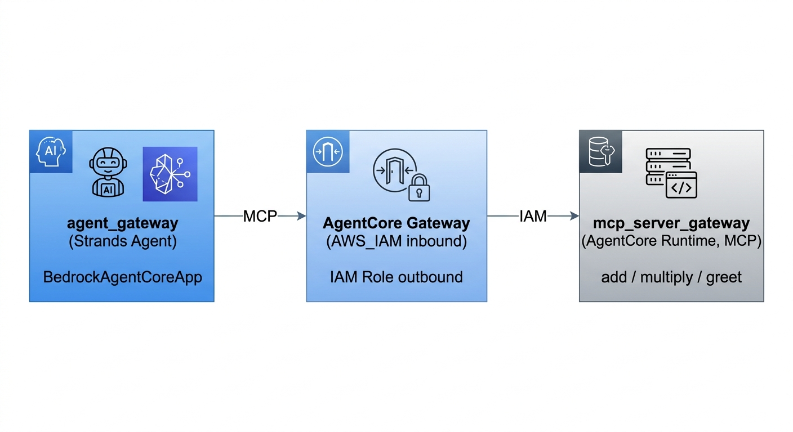
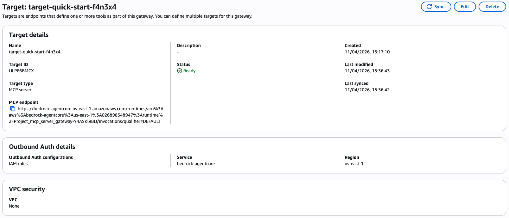

# Amazon Bedrock AgentCore Gateway Setup Guides

Amazon Bedrock AgentCore Gateway is a fully managed service that transforms existing APIs, MCP Servers, Smithy Models and Lambda functions into standardized, agent-ready tools using the Model Context Protocol (MCP).

It serves as a secure, centralized access point for agents to discover and invoke tools, handling complex inbound/outbound authentication and infrastructure scaling automatically.

This repository contains a step-by-step guide for setting up an **Amazon Bedrock AgentCore Gateway** that exposes an MCP server to a Strands agent, secured end-to-end with AWS IAM.

## Prerequisites

- **AWS Account** with credentials configured (`aws configure`)
- **Node.js** 20.x or later
- **uv** ([install](https://docs.astral.sh/uv/getting-started/installation/))
- **agentcore CLI** ([install](https://github.com/aws/agentcore-cli))

## Key Commands

| Command | Description |
|---|---|
| `agentcore add` | Add a resource (agent, gateway, …) |
| `agentcore deploy -y` | Deploy all resources to AWS |
| `agentcore invoke --name <name>` | Invoke a deployed agent |
| `agentcore status` | Show deployment status |

## References

- [AgentCore Gateway Developer Guide](https://docs.aws.amazon.com/bedrock-agentcore/latest/devguide/gateway.html)
- [AgentCore Gateway Core Concepts](https://docs.aws.amazon.com/bedrock-agentcore/latest/devguide/gateway-core-concepts.html)
- [AgentCore Samples on GitHub](https://github.com/awslabs/amazon-bedrock-agentcore-samples/tree/main/01-tutorials/02-AgentCore-gateway)
- [AgentCore CLI](https://github.com/aws/agentcore-cli)

---

## Gateway with IAM Role Authorization

This walkthrough builds a complete setup where an **AgentCore Runtime MCP server** is exposed through an **AgentCore Gateway**, and a **Strands agent** connects to it, all secured end-to-end using AWS IAM.


<p align="center"></p>
---

### Step 1 — Deploy the MCP Server

Create and deploy a containerized MCP server to AgentCore Runtime. The server exposes three tools (`add_numbers`, `multiply_numbers`, `greet_user`) and is protected by **AWS IAM** inbound authorization.

```bash
agentcore add agent \
  --name mcp_server_gateway \
  --type create \
  --build container \
  --protocol MCP \
  --language python \
  --memory none \
  --authorizer-type AWS_IAM

agentcore deploy -y
```

The generated `app/mcp_server_gateway/main.py` exposes the tools via FastMCP over streamable HTTP:

```python
from mcp.server.fastmcp import FastMCP

mcp = FastMCP("mcp_server_gateway", host="0.0.0.0", stateless_http=True)


@mcp.tool()
def add_numbers(a: int, b: int) -> int:
    """Add two numbers together"""
    return a + b


@mcp.tool()
def multiply_numbers(a: int, b: int) -> int:
    """Multiply two numbers together"""
    return a * b


@mcp.tool()
def greet_user(name: str) -> str:
    """Greet a user by name"""
    return f"Hello, {name}! Nice to meet you."


if __name__ == "__main__":
    mcp.run(transport="streamable-http")

```

Before deploying, make sure OpenTelemetry is enabled — without it the container will fail to start. Enable it in [agentcore/agentcore.json](agentcore/agentcore.json):

```json
"instrumentation": {
    "enableOtel": true
},
```

And add the required dependency to `app/mcp_server_gateway/pyproject.toml`:

```toml
dependencies = [
    "aws-opentelemetry-distro >= 0.17.0",
    "mcp >= 1.19.0",
]
```

Then regenerate the lock file so the Docker build picks it up:

```bash
cd app/mcp_server_gateway && uv lock && cd ../..
```

After deployment, note the **Runtime ARN** — you will need it in Step 3. It follows this pattern:

```
arn:aws:bedrock-agentcore:<region>:<account-id>:runtime/Project_mcp_server_gateway-<suffix>
```

---

### Step 2 — Create the AgentCore Gateway

Create a gateway with **AWS IAM** as the inbound authorizer and **Semantic Search** enabled so the agent can discover tools by natural language description.

```bash
agentcore add
```

When prompted, provide the following values:

| Field | Value |
|---|---|
| Resource type | `gateway` |
| Name | `my-gateway` |
| Authorizer type | `AWS IAM` |
| Advanced configuration | Enable **Semantic Search** |

This registers the gateway in [agentcore/agentcore.json](agentcore/agentcore.json) under `agentCoreGateways`. After deploying, note the **Gateway MCP URL** — it will look like:

```
https://project-my-gateway-<suffix>.gateway.bedrock-agentcore.<region>.amazonaws.com/mcp
```

---

### Step 3 — Add the MCP Server as a Gateway Target (AWS Console)

> **CLI limitation (agentcore CLI v0.8.0, April 2026):** Creating a gateway target with **IAM Role outbound authentication** is not yet supported by the CLI. This step must be completed in the AWS Console. This issue has been reported at: https://github.com/aws/agentcore-cli/issues/819

Navigate to **Amazon Bedrock → AgentCore → Gateways → `my-gateway` → Add target** and configure:



| Field | Value |
|---|---|
| Target type | MCP Server |
| MCP Endpoint | See format below |
| Outbound Auth | **IAM Role** |

**MCP Endpoint format** — URL-encode the runtime ARN and append the qualifier:

```
https://bedrock-agentcore.<region>.amazonaws.com/runtimes/<url-encoded-runtime-arn>/invocations?qualifier=DEFAULT
```

Example:
```
https://bedrock-agentcore.us-east-1.amazonaws.com/runtimes/arn%3Aaws%3Abedrock-agentcore%3Aus-east-1%3A<account-id>%3Aruntime%2FProject_mcp_server_gateway-<suffix>/invocations?qualifier=DEFAULT
```

**IAM policy for the gateway execution role** — attach this policy to the role selected as outbound auth so the gateway is allowed to invoke the runtime.

> `Project_mcp_server_gateway` is the runtime name from Step 1. Replace it if you used a different name.
```json
{
  "Version": "2012-10-17",
  "Statement": [
    {
      "Sid": "AllowGatewayToInvokeRuntime",
      "Effect": "Allow",
      "Action": "bedrock-agentcore:InvokeAgentRuntime",
      "Resource": [
                    "arn:aws:bedrock-agentcore:<region>:<account-id>:runtime/Project_mcp_server_gateway-<suffix>",
                    "arn:aws:bedrock-agentcore:<region>:<account-id>:runtime/Project_mcp_server_gateway-<suffix>/*"
                  ]
    }
  ]
}
```

Replace `<region>`, `<account-id>`, and `<suffix>` with your actual values from Step 1.

---

### Step 4 — Create the Agent

Create a Strands agent that connects to the gateway over MCP. Because the gateway was already created in Step 2, the CLI automatically generates the MCP client wiring.

```bash
agentcore add agent \
  --name agent_gateway \
  --type create \
  --build container \
  --language python \
  --framework Strands \
  --model-provider Bedrock \
  --memory none
```

The CLI generates `app/agent_gateway/mcp_client/client.py`, which reads the gateway URL from an environment variable and signs requests with AWS IAM (`aws_iam_streamablehttp_client`). Under the hood, AWS automatically signs every outbound request using [AWS Signature Version 4 (SigV4)](https://docs.aws.amazon.com/AmazonS3/latest/API/sig-v4-authenticating-requests.html) — no manual signing is required.

```python
from mcp_proxy_for_aws.client import aws_iam_streamablehttp_client

def get_my_gateway_mcp_client() -> MCPClient | None:
    url = os.environ.get("AGENTCORE_GATEWAY_MY_GATEWAY_URL")
    if not url:
        return None
    return MCPClient(lambda: aws_iam_streamablehttp_client(
        url,
        aws_service="bedrock-agentcore",
        aws_region=os.environ.get("AWS_REGION")
    ))
```

Then add the Gateway MCP URL you noted from Step 2 to the agent's `envVars` in [agentcore/agentcore.json](agentcore/agentcore.json):

```json
"envVars": [
  {
    "name": "AGENTCORE_GATEWAY_MY_GATEWAY_URL",
    "value": "https://project-my-gateway-<suffix>.gateway.bedrock-agentcore.<region>.amazonaws.com/mcp"
  }
]
```

Finally, deploy:

```bash
agentcore deploy -y
```

---

### Verification

Invoke the agent with a prompt that exercises one of the MCP server's tools:

```bash
agentcore invoke --runtime agent_gateway --target default --prompt "Greet me, my name is Alvaro"
```

A successful response matching the output from the `greet_user` tool confirms the full chain is working: the agent reached the gateway, the gateway authenticated via IAM and forwarded the request to the MCP server runtime, and the tool result was returned.

---

### Architecture Summary

| Component | Auth mechanism | Role |
|---|---|---|
| `mcp_server_gateway` runtime | AWS IAM (inbound) | Exposes MCP tools |
| AgentCore Gateway | AWS IAM (inbound) | Unified MCP endpoint with semantic search |
| Gateway → runtime | IAM Role (outbound) | Signed invocation of the runtime |
| `agent_gateway` → gateway | AWS SigV4 via `aws_iam_streamablehttp_client` (signed automatically) | Signed MCP requests |
